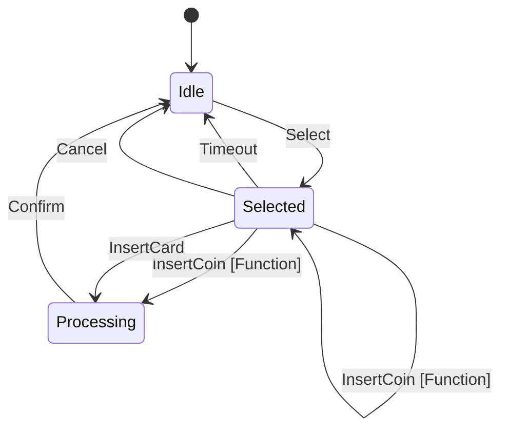

# Inżynieria Oprogramowania 2 (IO2)

## Wprowadzenie

Witaj w repozytorium z materiałami do przedmiotu **Inżynieria Oprogramowania 2** prowadzonym na Wydziale Matematyki i Nauk Informacyjnych Politechniki Warszawskiej.

Do rozpoczęcia tego kursu potrzebujesz następujących rzeczy:

1. [.NET 8 SDK](https://dotnet.microsoft.com/en-us/download/dotnet/8.0).
2. Sklonuj repozytorium Git
```
git clone https://github.com/sulmar/pw-mini-io2-2025
```

## Zakres
1. **Wprowadzenie Git** (init, clone, status, add, commit, push, pull, fetch, merge, branch, checkout, log, stash, tag)
2. **Wprowadzenie do GitHub** (Issues, Pull Request, Actions)
3. **Wprowadzenie do testów automatycznych** (testy jednostkowe, testy integracyjne, technika TDD, nazewnictwo, Arrange-Act-Assert, mocks)
4. **Wprowadzenie do wzorców projektowych** (Fabryka, Budowniczy, Adapter, Proxy, Kompozyt, Dekorator, Szablon metody, Strategia, Stan, Łańcuch odpowiedzialności)


## Graph


